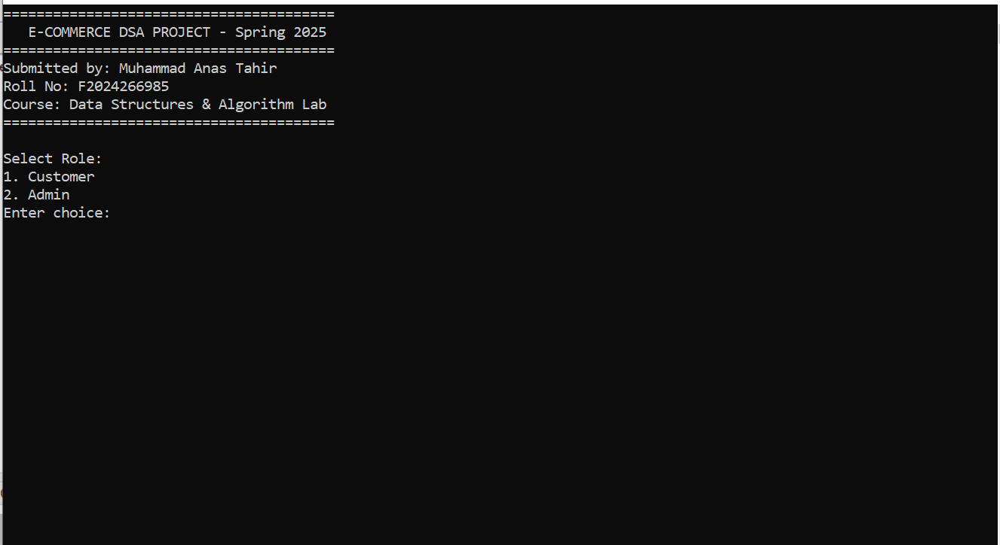
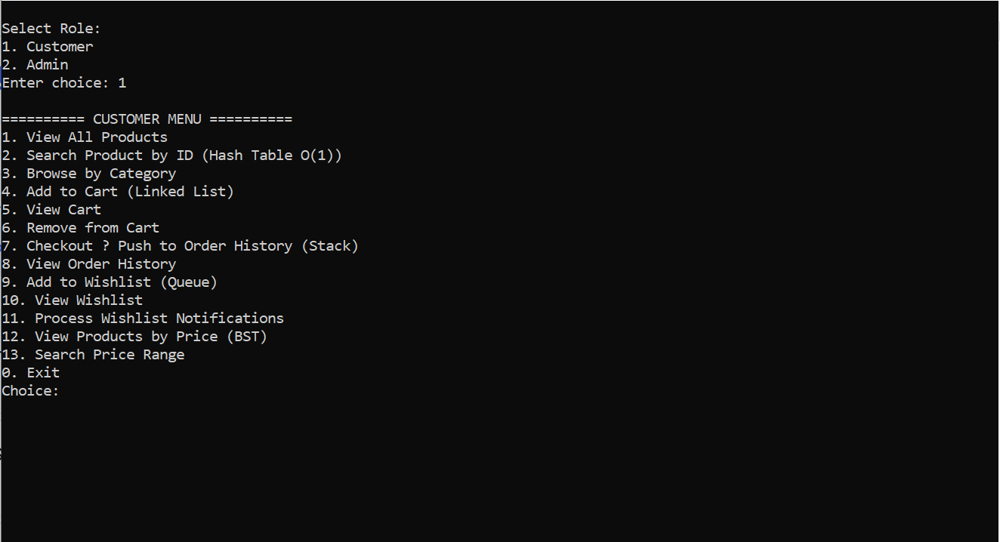
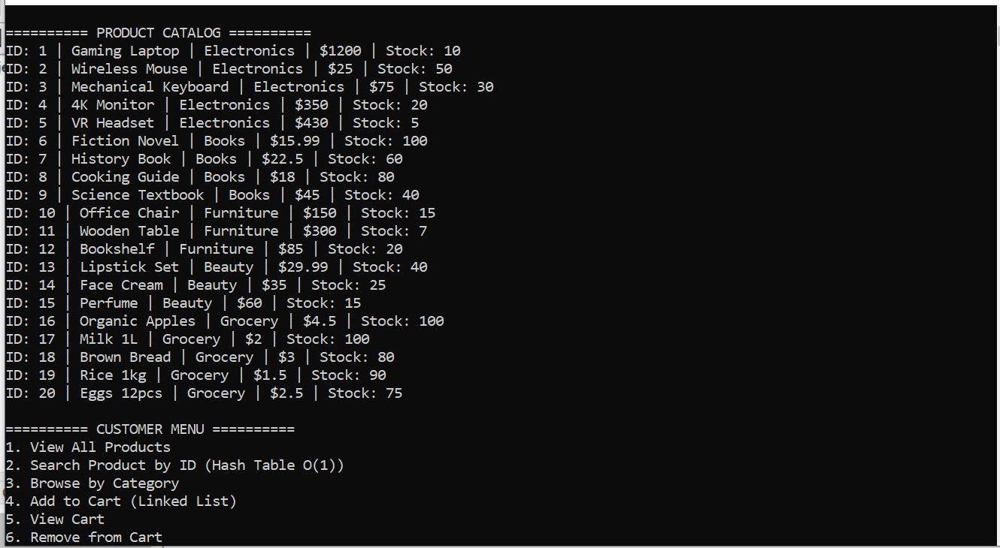
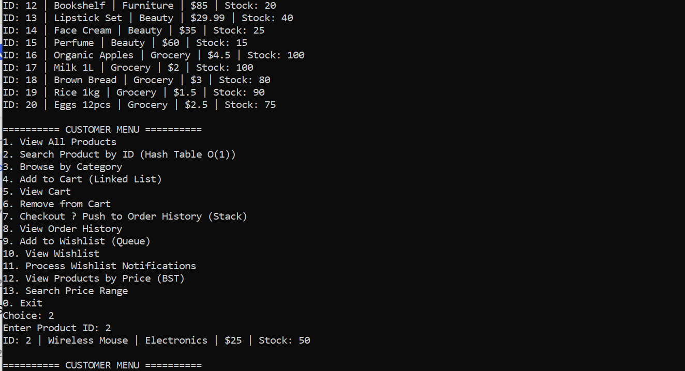
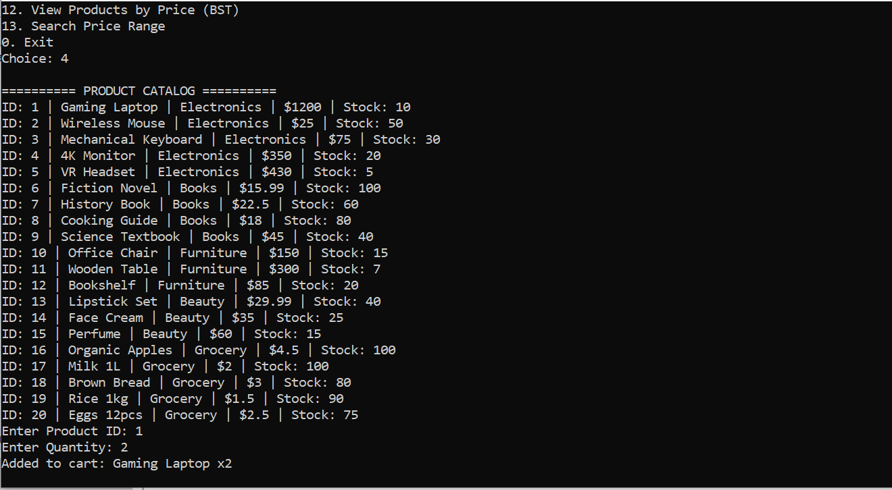
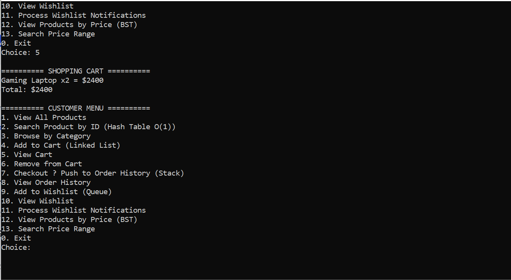
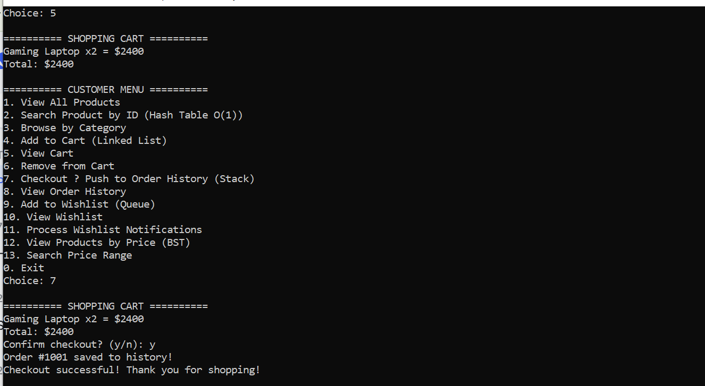
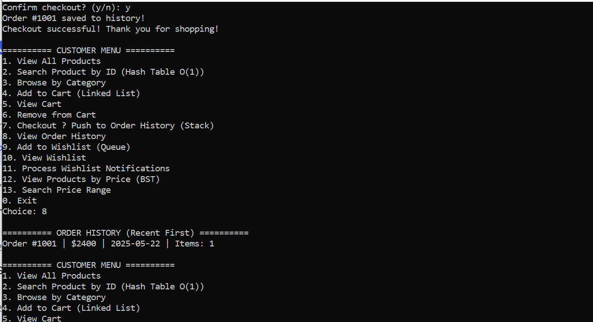
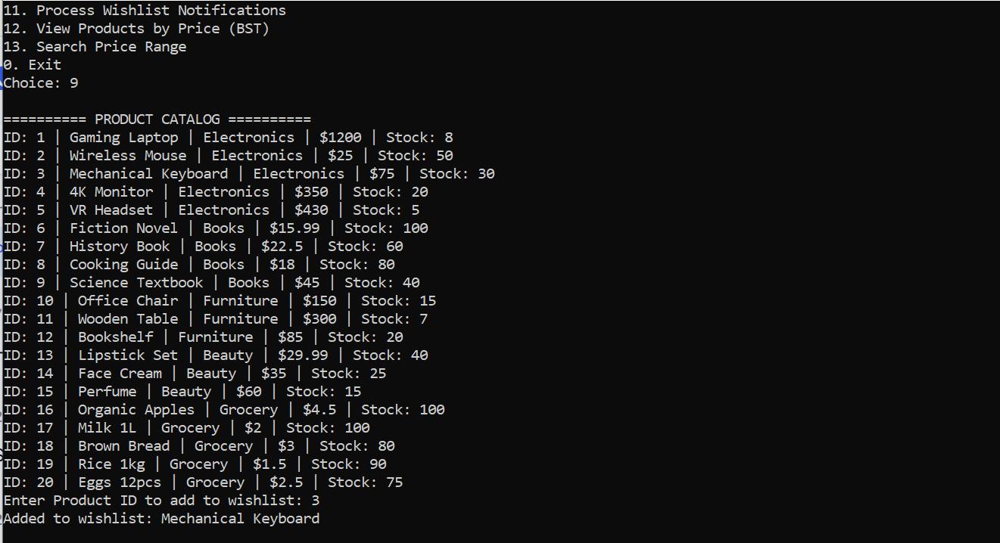
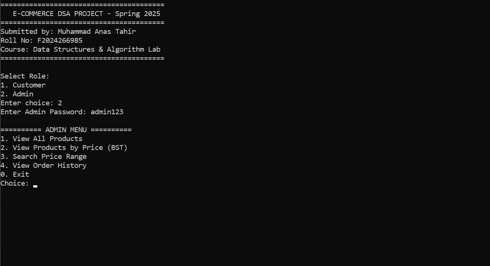

# E-Commerce DSA System

**Course:** Data Structures & Algorithm Lab | **Semester:** Spring 2025
**Student:** Muhammad Anas Tahir | **Roll No:** F2024266985
**University:** UMT, Lahore Campus

---

## Data Structures Implemented

| # | Data Structure | Application | Time Complexity |
|---|----------------|-------------|-----------------|
| 1 | Hash Table | Product Catalog Search | O(1) average |
| 2 | Linked List | Shopping Cart | O(1) insert |
| 3 | Stack | Order History (LIFO) | O(1) push/pop |
| 4 | Queue | Wishlist (FIFO) | O(1) enqueue/dequeue |
| 5 | Binary Search Tree | Price-Sorted Browsing | O(log n) average |

---

## 📸 Screenshots

### Main Menu


### Customer Menu


### Product Catalog (Hash Table)


### Search Product - O(1) Hash Table


### Shopping Cart (Linked List)



### Checkout & Order History (Stack - LIFO)



### Wishlist (Queue - FIFO)



### Price Sorted (Binary Search Tree)


### Admin Menu


---

## ⚠️ Important Note on Data Persistence

This project demonstrates **pure in-memory data structures**:

| Feature | Behavior |
|---------|----------|
| Stack (Order History) | ✅ Works within same session |
| Queue (Wishlist) | ✅ Works within same session |
| Data after program exits | ❌ Resets (in-memory only) |

**Why?** The focus is on demonstrating DSA behavior (LIFO, FIFO, O(1) search) without database/file persistence. Each run starts fresh.

**For persistent storage**, see my [OOP E-Commerce Project](https://github.com/anastahir00/OOP-Ecommerce-System) which uses file I/O.

---

## How to Compile & Run

```bash
g++ src/DSA_Ecommerce.cpp -o ecommerce.exe
./ecommerce.exe